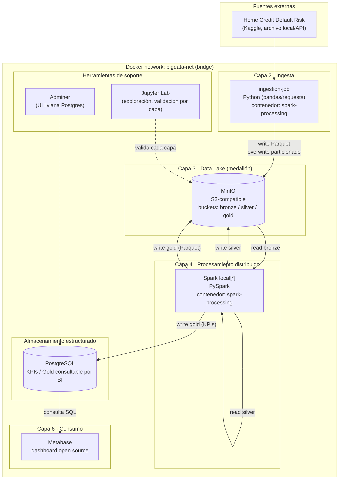
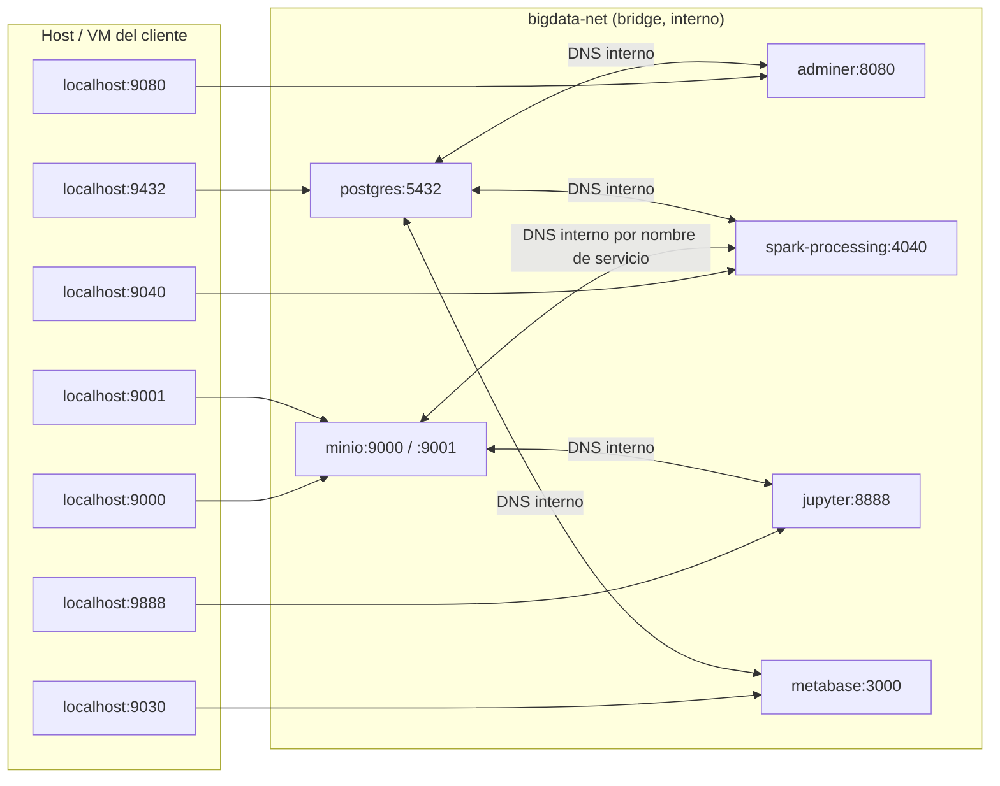
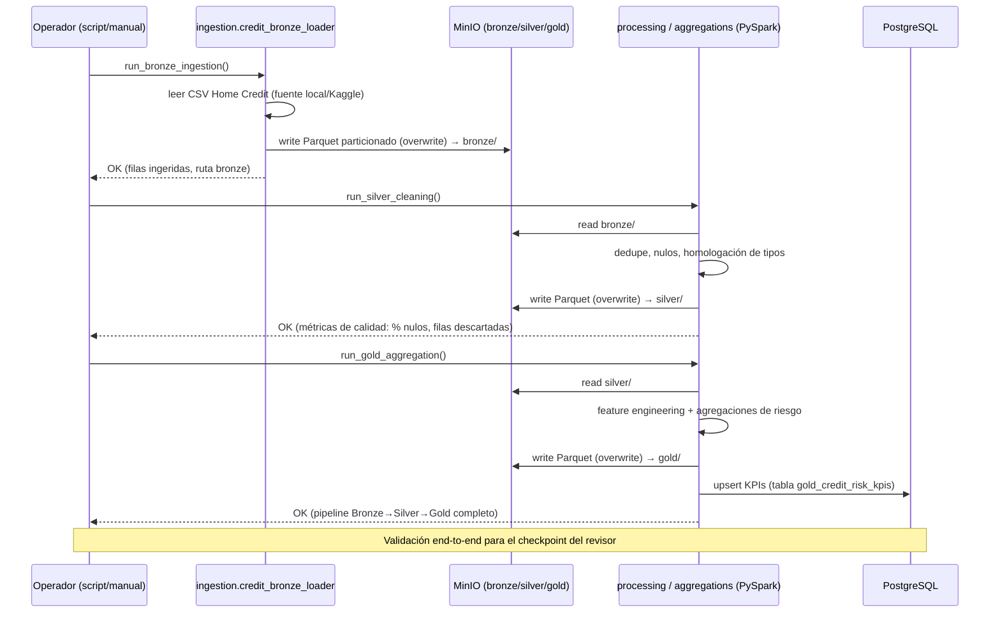
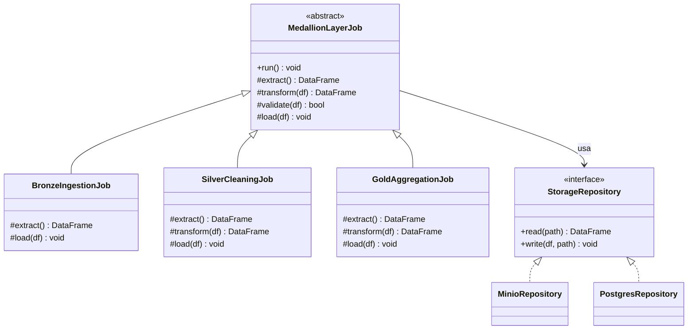

# Arquitectura Big Data — Riesgo Crediticio
### Diseño de PoC/MVP — arquitectura, comportamiento y dockerización
**Fecha:** 09 de septiembre de 2026
**Ref:** `docs/kick-off-project.md`, `docs/01-alcance-tecnico.md`, `docs/02-gaps-implementacion.md`, Capítulo II del documento de tesis

Este documento traduce la arquitectura de 6 capas ya aprobada en el documento de tesis a un **diseño de PoC/MVP concreto, 100% open source, dockerizado y ejecutable en una sola máquina** (VM o laptop), cerrando el hito exigido por el revisor: Docker funcionando + medallón hasta Gold.

---

## 1. Alcance del MVP (qué entra y qué queda para después)

Dado que es un proyecto de tesis y el hito inmediato es demostrar el pipeline funcionando, el MVP se acota deliberadamente:

| Incluido en el MVP | Diferido a iteración 2 |
|---|---|
| Dataset principal Home Credit Default Risk (Bronze → Silver → Gold) | Fuentes macroeconómicas (World Bank, IMF, FRED, Yahoo Finance, Nasdaq, BIS, EIA) |
| MinIO como Data Lake (Bronze/Silver/Gold en Parquet) | Delta Lake / merge idempotente avanzado (se usa `overwrite` particionado) |
| PostgreSQL para datos estructurados/KPIs de Gold | Apache Airflow (orquestación automática) — el pipeline se dispara manualmente o con un script |
| Spark en **modo local** (single container, sin cluster master/worker) | Spark cluster real (1 master + N workers) — solo si el hardware del cliente lo permite |
| Jupyter para exploración y validación de cada capa | Great Expectations (validación de calidad de datos formal) |
| **Metabase** (Capa 6 · Consumo, dashboard open source dentro de Docker) | Modelos ML servidos (Random Forest/XGBoost) — la capa Gold deja los features listos, el modelado es iteración 2 |

**Justificación de Spark en modo local (no cluster):** el documento de tesis exige "procesamiento distribuido" pero no especifica número de nodos. Un cluster master/worker en contenedores separados consume RAM adicional solo por overhead de coordinación, sin aportar valor real en un dataset de ~215K filas corriendo en una sola máquina. Spark en `local[*]` sigue usando la misma API distribuida (RDD/DataFrame, particionamiento, planificador Catalyst) — cumple el requisito académico y de arquitectura, y dejamos el cluster real documentado como camino de escalamiento (sección 6).

**Capa 6 · Consumo:** implementada con **Metabase** (open source, dentro de Docker, corre en el mismo Linux que todo lo demás) — es la herramienta de dashboard de esta arquitectura, consultando `gold_credit_risk_kpis` en PostgreSQL.

---

## 2. Diagrama de arquitectura (capas + contenedores)

**Notas de diseño:**
- **Un solo contenedor `spark-processing`** ejecuta ingesta + Bronze + Silver + Gold (mismo runtime Python/PySpark) para minimizar el número de imágenes y RAM total. La separación de responsabilidades se resuelve por **código** (módulos `ingestion/`, `processing/`, `aggregations/`), no por contenedor — coherente con la estructura de carpetas ya definida en `CLAUDE.md`.
- **MinIO es la única fuente de verdad del Data Lake.** Postgres solo recibe la capa Gold ya agregada (KPIs), para que Metabase tenga una fuente relacional simple sin necesitar drivers Parquet/S3.
- **Metabase corre dentro de Docker** (mismo Linux/on-premise que todo el stack) como implementación de la Capa 6 · Consumo — arma dashboards por SQL/clics sobre `gold_credit_risk_kpis`, sin depender de un sistema operativo distinto ni de licencias externas.
- Metabase guarda su propio metadata (dashboards, usuarios) en un archivo H2 embebido con volumen propio (`metabase-data`) — deliberadamente separado de `postgres-data`, para no mezclar el estado de la app de BI con los datos de negocio del pipeline.

---

## 3. Diagrama de red y puertos (Docker Compose)

Requisito del cliente: **evitar el puerto 8080** y usar rango **90xx en adelante** para todo lo expuesto al host, para prevenir choques con otros servicios comunes (Tomcat, proxies, otras PoCs) en la máquina donde se replique.

| Servicio | Puerto interno | Puerto host | Uso |
|---|---|---|---|
| MinIO API (S3) | 9000 | **9000** | Acceso S3 desde Spark/Python (`boto3`, `s3a://`) |
| MinIO Console (UI web) | 9001 | **9001** | Explorar buckets bronze/silver/gold desde el navegador |
| PostgreSQL | 5432 | **9432** | Conexión JDBC/ODBC desde Adminer, Spark, Metabase |
| Adminer (UI Postgres) | 8080 | **9080** | Inspección rápida de tablas Gold sin instalar pgAdmin |
| Metabase (dashboard) | 3000 | **9030** | Capa 6 · Consumo — dashboards visuales sobre `gold_credit_risk_kpis` |
| Spark UI (driver, modo local) | 4040 | **9040** | Ver jobs/stages del pipeline mientras corre |
| Jupyter Lab | 8888 | **9888** | Notebooks de validación por capa (bronze/silver/gold) |

Todos los servicios comparten una única red bridge definida en el compose (`bigdata-net`) y se resuelven entre sí **por nombre de servicio** (DNS interno de Docker) — nunca por IP ni por `localhost`, para que el mismo compose funcione igual en cualquier máquina que lo replique.

---

## 4. Diagrama de comportamiento (pipeline end-to-end)

**Idempotencia:** cada etapa escribe con `mode("overwrite")` sobre particiones bien definidas (ej. por fecha de carga o snapshot), de modo que **re-ejecutar el pipeline completo no duplica datos** — requisito explícito de las reglas de código del proyecto.

---

## 5. Patrones de diseño a aplicar

El objetivo es mantener el código simple pero con las costuras correctas para que la tesis pueda mostrar un diseño de software defendible, sin sobre-ingeniería (no se diseña para casos hipotéticos que no están en el alcance del MVP).

| Patrón | Dónde se aplica | Por qué |
|---|---|---|
| **Singleton** (vía función cacheada, no clase) | `src/common/session.py` — `get_spark_session()` | Una sola SparkSession por proceso; evita overhead de crear sesiones repetidas en cada módulo |
| **Factory Method** | `src/ingestion/` — un `SourceLoaderFactory` que devuelve el loader correcto (`KaggleCreditLoader` en el MVP; `WorldBankLoader`, etc. en iteración 2) | Permite añadir nuevas fuentes (macro) en iteración 2 sin tocar el orquestador del pipeline |
| **Template Method** | `src/processing/` y `src/aggregations/` — clase base `MedallionLayerJob` con método `run()` fijo (`extract → transform → validate → load`) y hooks que cada capa sobreescribe | Bronze/Silver/Gold comparten el mismo esqueleto de ejecución; el código específico de cada capa queda aislado y testeable |
| **Strategy** | Reglas de limpieza en Silver (ej. estrategia de imputación de nulos por tipo de columna) | Permite cambiar la estrategia de limpieza de una columna sin reescribir el job completo |
| **Repository** | `src/common/storage.py` — `MinioRepository` / `PostgresRepository` abstraen lectura/escritura | El código de negocio (`processing/`, `aggregations/`) no conoce `boto3` ni `psycopg2` directamente — facilita testear con mocks |
| **Adapter** | Iteración 2, `src/ingestion/` — normaliza respuestas heterogéneas de World Bank/FRED/Yahoo Finance a un esquema común antes de Bronze | Cada API macro tiene un formato distinto; el Adapter aísla esa variabilidad del resto del pipeline |
| **Idempotent Writer** (patrón arquitectónico, no GoF) | Todas las escrituras a MinIO/Postgres | Reprocesar Bronze→Silver→Gold no debe duplicar ni corromper datos — requisito ya fijado en `CLAUDE.md` |

---

## 6. Dimensionamiento de recursos (máquina mínima)

Meta explícita del cliente: que corra en **una sola máquina/VM** sin fricción para quien lo replique.

| Servicio | RAM (límite) | CPU (límite) | Notas |
|---|---|---|---|
| `minio` | 512 MB | 0.5 | Suficiente para Parquet de ~215K filas por capa |
| `postgres` | 256 MB | 0.5 | Solo almacena KPIs agregados de Gold, no datos crudos |
| `spark-processing` (driver + executor local) | 3 GB | 2.0 | El consumidor de RAM principal; `local[2]` recomendado |
| `jupyter` | 1 GB | 0.5 | Comparte imagen/entorno con `spark-processing` si se desea ahorrar espacio |
| `adminer` | 64 MB | 0.25 | UI liviana, sin estado |
| `metabase` | 1.5 GB | 1.0 | JVM (Clojure) — el segundo mayor consumidor de RAM tras Spark; metadata propia en volumen `metabase-data` |
| **Total aproximado** | **~6.3 GB** | **~4.75 vCPU** | Con Metabase agregado, el mínimo recomendado de VM sube a **10 GB RAM / 4 vCPU** (los límites de CPU son techos, no reservas — 4 vCPU físicos siguen alcanzando) |

Si el equipo del cliente tiene menos de 8 GB disponibles para Docker, se puede: (a) fusionar `jupyter` dentro de `spark-processing` (mismo contenedor, distinto comando), o (b) correr Spark con `local[1]` y 2 GB. Ambas opciones quedan como variables de ajuste en `.env`, no como cambio de arquitectura.

---

## 7. Próximos pasos (implementación)

1. Confirmar con el cliente el dimensionamiento de la sección 6 (pregunta abierta #1 de `02-gaps-implementacion.md`).
2. Levantar `src/docker-compose.yml` con la red y puertos de la sección 3.
3. Implementar `src/common/session.py` y `src/common/storage.py` (Singleton + Repository).
4. Implementar `src/ingestion/credit_bronze_loader.py` (Bronze).
5. Implementar `src/processing/` (Silver) y `src/aggregations/` (Gold) sobre `MedallionLayerJob`.
6. Validar end-to-end en Docker antes del checkpoint con el revisor.

---
*Entregable de diseño — arquitectura PoC/MVP dockerizada · Fuente: kick-off del revisor, 08 sept 2026 · Alcance técnico, `docs/01` y `docs/02`*
