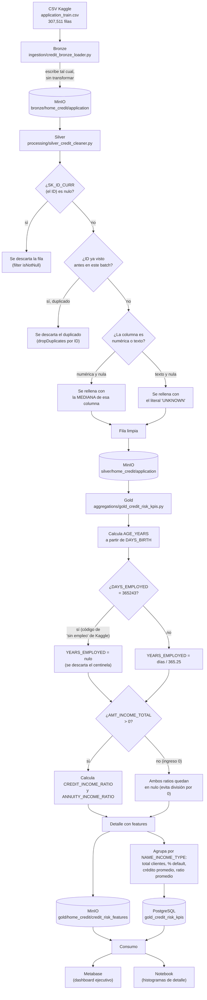
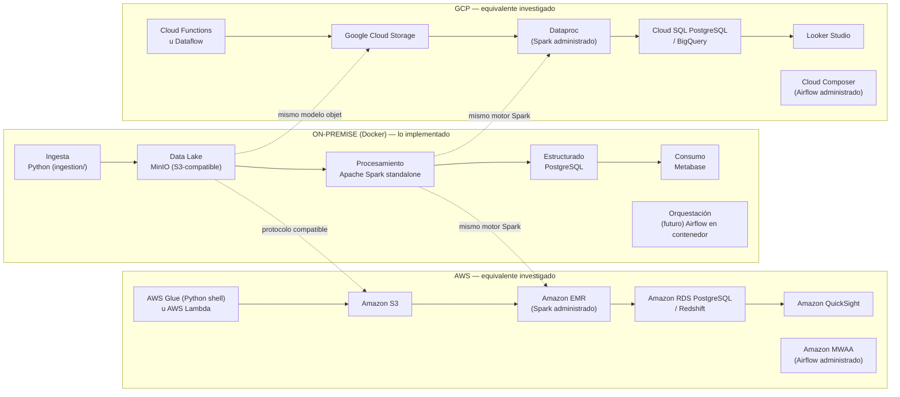

# Guía de componentes — qué hace cada pieza y cómo demostrarlo
### Para entender y defender la arquitectura, no solo para levantarla
**Fecha:** 09 de septiembre de 2026
**Ref:** `docs/03-arquitectura-poc-mvp.md` (arquitectura técnica), `docs/04-manual-usuario.md` (paso a paso operativo), Capítulo II del documento de tesis

Este documento es distinto a los otros dos: `docs/03` explica *cómo está diseñado* y `docs/04` explica *cómo levantarlo y verificarlo*. Este explica, en simple, **qué es y para qué sirve cada pieza**, **dónde ver el resultado**, y **cómo repetir la demo en vivo** si el profesor pide "hazlo de nuevo".

---

## 1. El mapa completo, en una frase por pieza

| # | Capa (tesis, Cap. II) | Herramienta | En una frase |
|---|---|---|---|
| 1 | Fuentes de datos | Kaggle (Home Credit Default Risk) | De ahí viene el dato crudo: 307,511 solicitudes de crédito reales, anonimizadas |
| 2 | Ingesta | Python (`ingestion/`) | Lee el CSV y lo mete al Data Lake sin tocarlo |
| 3 | Data Lake (medallón) | **MinIO** | Guarda los datos en 3 estados: crudo (Bronze), limpio (Silver), listo para analizar (Gold) |
| 4 | Procesamiento distribuido | **Spark / PySpark** | El motor que limpia, transforma y calcula |
| 5 | Analítica / estructurado | **PostgreSQL** | Guarda los KPIs ya calculados, en tablas que cualquier BI entiende |
| 6 | Consumo | **Metabase** (dashboard open source) | Donde se ve el resultado final |
| — | Soporte | **Jupyter**, **Adminer**, **Spark UI** | Ventanas para *comprobar* que las capas de arriba funcionan |

**La idea que hay que poder explicar en una frase:** el dato nunca se modifica donde llegó — cada capa escribe una copia mejorada en la siguiente (Bronze → Silver → Gold). Eso es la "arquitectura medallón".

### 1.1 La analogía: esto es un cloud, simulado con Docker

Si el profesor pregunta "¿por qué no usaron AWS/GCP/Azure?", la respuesta corta ya está en la sección 6 — pero para explicarlo con peras y manzanas, la idea es esta:

> **Docker Compose hace aquí el papel de "nube privada".** Cada contenedor es el equivalente casero de un servicio cloud real: MinIO es "nuestro S3", Postgres + Metabase son "nuestro Redshift/QuickSight", Spark es "nuestro EMR". No es una nube de verdad porque el revisor pidió on-premise (`docs/01-alcance-tecnico.md`) — pero está diseñado para que, el día que se quiera migrar, sea mover contenedores a servicios administrados, no reescribir el pipeline. Se habla el mismo protocolo (S3) y el mismo motor (Spark) que usaría un proveedor real.

Y el punto de entrada de datos se explica igual, con una analogía: en un sistema real de una entidad financiera, ese primer archivo (`application_train.csv`) llegaría por una **API externa** (el buró de crédito, el core bancario, una fuente macroeconómica como el Banco Mundial). Aquí, para no depender de conexión a esas APIs en cada demo, **se simula esa entrega con un archivo ya descargado de Kaggle** — cumple el mismo rol: es "la respuesta que nos daría la API" convertida en un archivo fijo y reproducible. `src/ingestion/` es exactamente el punto donde, en una versión productiva, ese CSV se reemplazaría por una llamada real a la API (ver preguntas abiertas en `docs/01-alcance-tecnico.md`) — hoy actúa como su simulador.

---

## 2. Ficha rápida de cada herramienta

| Herramienta | Qué es | Para qué sirve aquí | Cómo verla |
|---|---|---|---|
| **MinIO** | "Disco" que habla el protocolo S3 (el estándar de facto para Data Lakes) | Guarda los Parquet de bronze/silver/gold | http://localhost:9001 |
| **Spark / PySpark** | Motor que procesa datos en paralelo | Corre los 3 jobs (Bronze→Silver→Gold): limpia, transforma, calcula KPIs | Spark UI, ver sección 4 |
| **PostgreSQL** | Base de datos relacional clásica (SQL) | Recibe solo el resultado final (Gold) — el "puente" hacia BI | Adminer o `psql` |
| **Jupyter Lab** | Cuaderno interactivo de Python | Explorar datos y correr el notebook-dashboard (sección 3) | http://localhost:9888 |
| **Adminer** | UI web mínima para SQL | Ver la tabla de KPIs sin instalar nada | http://localhost:9080 |
| **Spark UI** | Panel en vivo de Spark | Ver jobs/stages mientras el pipeline corre | http://localhost:9040 (solo mientras algo corre, ver sección 4) |
| **Metabase** | Herramienta open source de dashboards (arma gráficos con clics, sin SQL) | Consume `gold_credit_risk_kpis` de Postgres — la herramienta de la Capa 6 en esta arquitectura | http://localhost:9030 — ver sección 3 |

**Por qué MinIO y no solo carpetas / por qué Postgres no guarda todo:** MinIO existe porque el Data Lake necesita volumen + formato optimizado para que Spark lea en paralelo; Postgres solo recibe el resumen ya agregado porque las herramientas de negocio hablan SQL, no Parquet/S3. Son dos trabajos distintos, no una redundancia.

**Por qué Spark y no Pandas:** la tesis exige "procesamiento distribuido" — Pandas carga todo en un solo proceso; Spark particiona y procesa en paralelo, y el mismo código escalaría de 307K filas a millones sin reescribirse (más detalle en `docs/03`, sección 1).

---

## 3. Dashboard — dónde ver el resultado

Hasta hace poco no había un lugar visual para mostrar "esto es lo que acabamos de calcular" — Adminer solo muestra tablas crudas. Ahora hay dos opciones, para distinto uso:

### Opción principal: Metabase (persistente, con clics, sin SQL)

1. Abrir http://localhost:9030 (primera vez: crear cuenta admin local + conectar a Postgres, `postgres`/`5432`/`credit_risk`, ver `docs/04-manual-usuario.md` sección 6.4).
2. `+ New → Question` → elegir tabla `gold_credit_risk_kpis` → armar el gráfico (barras, torta, tabla) arrastrando columnas — sin escribir una sola línea de SQL.
3. Guardar como *Dashboard* — queda con una URL fija que se puede reabrir en cualquier momento (a diferencia del notebook, no hay que "correrlo" cada vez).

Es la implementación de la **Capa 6 · Consumo** de esta arquitectura (`docs/03`, sección 2).

### Opción rápida: notebook con gráficos ya armados

`src/notebooks/dashboard_riesgo_crediticio.ipynb` — ya probado, corre sin errores. Útil cuando se quiere algo ya armado de antemano (histogramas de edad/ratio crédito-ingreso que Metabase no arma solo) o para no depender de configurar la conexión en Metabase en el momento:

1. Abrir http://localhost:9888 (Jupyter Lab).
2. Abrir `dashboard_riesgo_crediticio.ipynb`.
3. `Kernel → Restart Kernel and Run All Cells`.

> Nota: `src/notebooks/*.ipynb` no se versiona en git (es un artefacto de exploración local, ver `.gitignore`) — si se replica en una VM nueva, hay que volver a crear este notebook o pedirlo aparte. Metabase sí persiste (guarda sus dashboards en el volumen `metabase-data`, sobrevive a `docker compose down` sin `-v`).

---

## 4. Re-ejecutar en caliente (para una demo en vivo)

Si el profesor dice "vuelve a correrlo" o "muéstrame que funciona de nuevo", esto es lo que se hace, en orden, para que se vea el proceso — no solo el resultado final:

1. **Disparar el pipeline dentro del contenedor interactivo** (así la Spark UI queda visible durante la corrida, a diferencia de `pipeline-runner` que se ejecuta y se cierra solo):
   ```bash
   docker compose exec spark-processing python run_pipeline.py
   ```
2. **Mientras corre** (dura segundos con este dataset), abrir http://localhost:9040 — se ven los Jobs/Stages de Spark en vivo. Esto es lo que demuestra que el procesamiento es realmente distribuido, no un script secuencial.
3. **Al terminar**, la terminal muestra `Bronze OK / Silver OK / Gold OK / Pipeline completado` — es la confirmación de que las tres capas se reescribieron.
4. **Confirmar en Metabase**: solo hace falta refrescar el dashboard (botón de recarga arriba a la derecha) — como consulta la tabla en vivo, no hay que "volver a correr" nada. Si se quiere el detalle de features (histogramas de edad/ratio), volver a correr el notebook-dashboard (sección 3) regenera esos gráficos con el resultado fresco.

**Por qué no duplica ni corrompe nada al repetirlo:** cada capa escribe con `overwrite` (reemplaza, no acumula) — correr esto 10 veces seguidas da exactamente el mismo resultado. Es la idempotencia que exige `CLAUDE.md` como regla de código, y es justo lo que hace segura una demo en vivo: no hay riesgo de "romper" el estado con una repetición.

---

## 5. El recorrido de un dato, sin jerga

1. Un CSV con 307,511 solicitudes de crédito llega desde Kaggle (simulando la API externa, ver sección 1.1).
2. **Bronze:** se copia tal cual a MinIO (Parquet) — es la materia prima, sin tocar.
3. **Silver:** Spark lee Bronze, limpia (nulos, tipos, duplicados), reescribe en MinIO.
4. **Gold:** Spark lee Silver, calcula columnas nuevas (edad, ratio crédito/ingreso) y agrega KPIs. Escribe el detalle en MinIO y el resumen en Postgres.
5. Postgres queda con la tabla final, lista para Metabase o el notebook-dashboard.

---

## 5.1 El flujo interno, decisión por decisión

La sección anterior dice *qué* pasa en cada capa; esta explica *cómo* decide cada job qué hacer con cada fila — para poder responder "¿y si el dato viene con un nulo, o duplicado, qué hace el sistema?" sin tener que abrir el código.



**Los puntos donde el sistema "decide" algo (para memorizar, no solo leer):**

| Capa | Decisión | Regla exacta | Por qué |
|---|---|---|---|
| Silver | Fila sin ID | Se descarta (`filter isNotNull`) | Sin `SK_ID_CURR` no hay forma de identificar al cliente ni de cruzar con otras tablas |
| Silver | Fila con ID repetido | Se queda solo una copia (`dropDuplicates`) | Evita contar dos veces al mismo solicitante en los KPIs |
| Silver | Nulo en columna numérica | Se rellena con la **mediana** de esa columna | La mediana no se distorsiona con valores extremos (a diferencia del promedio) |
| Silver | Nulo en columna de texto | Se rellena con `"UNKNOWN"` | Evita perder la fila completa por un solo campo vacío; queda trazable qué se imputó |
| Gold | `DAYS_EMPLOYED = 365243` | Se ignora ese valor al calcular años trabajados | Es un código especial de Kaggle para "no tiene empleo", no un dato real (`gold_credit_risk_kpis.py:15-17`) |
| Gold | `AMT_INCOME_TOTAL = 0` | Los ratios crédito/ingreso quedan nulos | Evita una división por cero que rompería el job |

**Idea para defender en una frase:** cada capa recibe la salida de la anterior y le agrega una responsabilidad nueva — Bronze solo copia, Silver solo limpia, Gold solo calcula. Ningún job hace el trabajo de otro, y cada uno puede volver a correr solo (sección 6.8 del manual) sin afectar a los demás porque todo se lee de MinIO, no de memoria compartida.

---

## 6. On-premise vs. Cloud (AWS/GCP/Azure): por qué esta decisión

Esta es probablemente la pregunta más dura del jurado, porque no tiene una respuesta técnica única — es una decisión de arquitectura con trade-offs, y hay que poder defenderla como tal (no como "no nos alcanzó el tiempo").

### La razón formal (la que consta en el proyecto)

El revisor pidió explícitamente, en el kick-off, "Docker funcionando + arquitectura medallón hasta la capa Gold" (ver `docs/01-alcance-tecnico.md`, sección 4) — el documento de tesis nunca exigió un proveedor cloud, todas las herramientas (Spark, Parquet, PostgreSQL) son agnósticas de infraestructura. Es decir: **on-premise no fue "lo fácil", fue lo que se pidió como próximo hito evaluable.**

### Las razones de arquitecto que la respaldan (para no sonar como que fue solo por obligación)

| Criterio | On-premise (Docker) — lo elegido | Cloud (AWS/GCP/Azure) |
|---|---|---|
| **Costo** | $0 — corre en la misma laptop, sin tarjeta de crédito ni facturación por hora | Real: EMR/Databricks + S3 + Redshift tienen costo por cómputo y almacenamiento, incluso en free tier hay límites y riesgo de cargos accidentales |
| **Tiempo de puesta en marcha** | `docker compose up`, minutos, sin crear cuenta ni pedir permisos a nadie | Requiere cuenta, tarjeta, configurar IAM/roles, VPC, permisos — días si es la primera vez |
| **Reproducibilidad para el jurado** | El jurado puede levantar el mismo entorno en su propia máquina con el repo, sin depender de que la nube del estudiante siga activa el día de la defensa | Si se apaga la cuenta cloud (por costo) después de la defensa, la demo deja de existir; hay que re-desplegar |
| **Aislamiento de datos sensibles** | El dataset (aunque es público/anonimizado) nunca sale de la máquina local | Cualquier dato subido a un bucket cloud implica pensar en políticas de acceso, cifrado en tránsito/reposo, residencia de datos — relevante si mañana fuera data real de clientes |
| **Escalabilidad real (elasticidad)** | Limitada a los recursos de la máquina — no crece solo si el volumen de datos aumenta | Ventaja real del cloud: autoscaling de Spark (EMR/Dataproc/Databricks), storage prácticamente ilimitado (S3/GCS/ADLS) |
| **Alta disponibilidad / DR** | No hay — si se apaga el Docker, se acabó el servicio | Multi-zona, réplicas, backups gestionados — necesario en producción real de una entidad financiera |
| **Gobernanza y cumplimiento** | Manual — no hay auditoría ni control de acceso fino por defecto | Servicios nativos (IAM granular, KMS, logging de auditoría) — obligatorio en banca real (ej. requisitos de superintendencia financiera) |

**La conclusión que debe poder decir en la defensa, en una frase:** *"Para un PoC/MVP académico que necesita ser reproducible, gratuito y verificable por el jurado sin depender de una cuenta cloud activa, on-premise con Docker es la decisión correcta — pero la arquitectura está diseñada para migrar sin reescribir código (MinIO habla protocolo S3, Spark es el mismo motor que usa EMR/Dataproc/Databricks), y si esto pasara a producción con datos reales de una entidad financiera, ahí sí el cloud gana por elasticidad, alta disponibilidad y cumplimiento regulatorio — que es justo lo que un PoC no necesita todavía."*

Esto es exactamente el mismo tipo de análisis costo-beneficio hecho para `project-bigdata-01` (memo on-premise vs. cloud ya enviado ahí) — aquí no hizo falta un memo formal porque el revisor ya había insinuado el camino, pero el razonamiento de fondo es el mismo.

### 6.1 Diagrama comparativo: lo mismo, en tres infraestructuras distintas

La idea de este diagrama es demostrar algo puntual ante el jurado: **no se usó Docker por desconocer la nube — se investigó el equivalente exacto en AWS y en GCP, y se documenta aquí a propósito.** Cada fila (capa de la arquitectura) es el mismo trabajo, resuelto con la herramienta que le toca según la infraestructura.



**Lectura del diagrama, en una frase:** la fila de en medio (Data Lake y Procesamiento) es la más importante de defender — MinIO habla el protocolo S3 y Spark es el mismo motor en los tres casos, así que ese es precisamente el punto de "portabilidad sin reescribir código" que se menciona en la sección 6 de arriba.

**Por qué se menciona GCP y no solo AWS (para responder "¿y por qué no directamente AWS, que es la más conocida?"):**

| | AWS | GCP |
|---|---|---|
| Punto fuerte reconocido en la industria | Ecosistema más grande y maduro (más servicios, más documentación, más adopción empresarial) | BigQuery — motor analítico serverless con muy buen rendimiento en consultas SQL sobre grandes volúmenes, frecuentemente citado como más fuerte específicamente para *analítica de datos* |
| Dónde encajaría mejor este proyecto | Si la prioridad fuera integrarse con un ecosistema empresarial ya en AWS | Si la prioridad fuera la capa Gold/analítica (los KPIs y el futuro modelado ML), por el motor de BigQuery y su integración nativa con herramientas de BI |
| Conclusión para la defensa | Ambas son válidas; se investigaron las dos deliberadamente para no depender de un solo proveedor — la arquitectura on-premise es agnóstica de cuál se elija después | |

---

## 7. Preguntas frecuentes de defensa (respuesta corta)

| Pregunta | Respuesta corta |
|---|---|
| ¿Por qué Docker y no instalar todo directo? | Reproducibilidad — el mismo compose levanta el ecosistema idéntico en cualquier máquina |
| ¿Por qué no la nube (AWS/GCP/Azure)? | Ver sección 6 — el revisor pidió on-premise como hito, y además es la opción correcta para un PoC académico (costo $0, reproducible por el jurado); MinIO habla el mismo protocolo que S3 real, así que migrar después no reescribe código |
| ¿Esto es "Big Data" corriendo en una laptop? | El volumen es deliberadamente manejable para demostrar la arquitectura; el patrón (Spark/MinIO) escala horizontalmente sin cambiar código |
| ¿Dónde está el dashboard? | Metabase, http://localhost:9030 (sección 3) — implementación open source de la Capa 6 |
| ¿Cómo repites la demo si te lo piden? | Sección 4 de esta guía — un comando, visible en la Spark UI, verificable en el notebook |
| ¿Dónde está el Machine Learning? | Fuera de este MVP — Gold deja los features listos; el modelado es iteración 2 (`docs/03`, sección 1) |
| ¿Por qué siempre `overwrite`? | Idempotencia — repetir el pipeline no debe duplicar datos, es requisito explícito del proyecto |

---
*Guía conceptual — complementa `docs/03-arquitectura-poc-mvp.md` (diseño técnico) y `docs/04-manual-usuario.md` (operación)*
