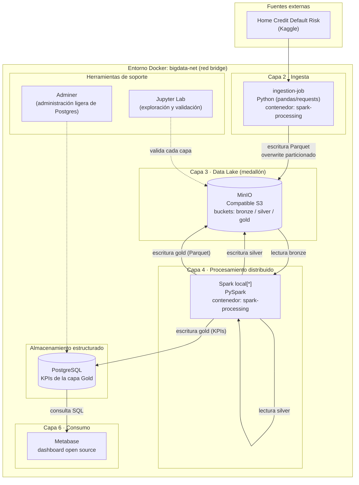
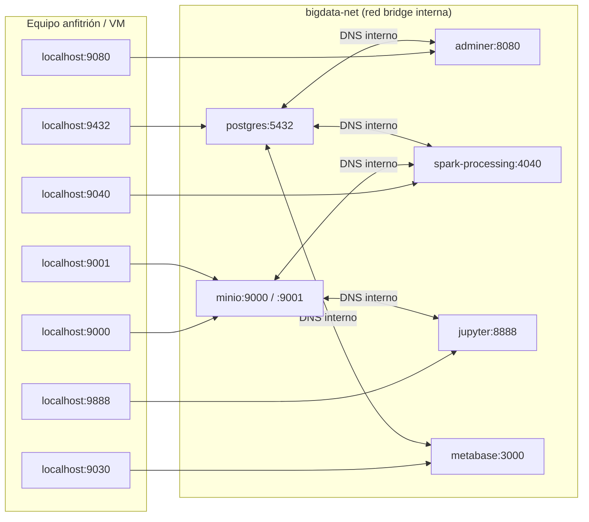
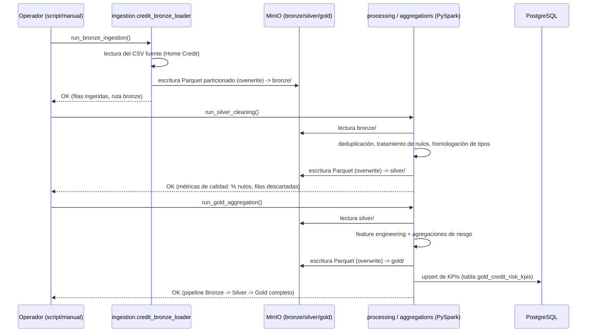
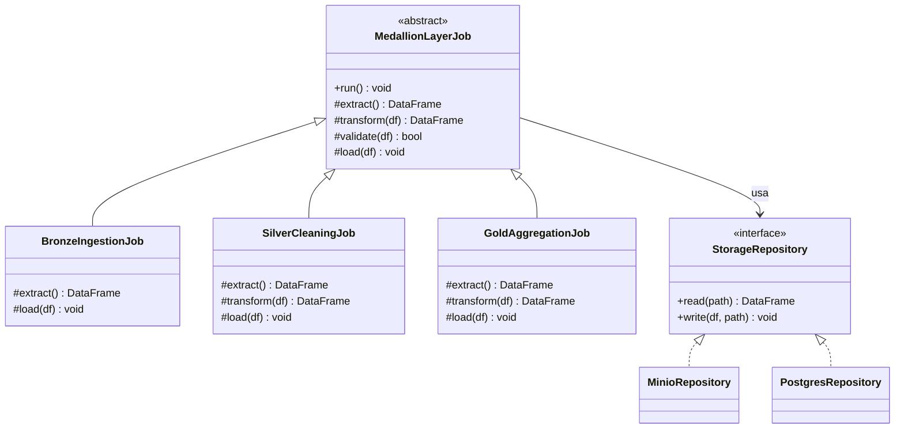

# Capítulo II: Propuesta — texto completo listo para pasar a Word

> Nota para el equipo del proyecto (esta nota no va en la tesis): este documento sigue **exactamente** la numeración del índice ya aprobado en `Plantilla de Proyecto de IEEE APR.docx` (2.1 a 2.3.4 + Conclusiones), para que cada encabezado de aquí se pueda copiar directo al lugar que le corresponde en el `.docx`.
>
> - **2.1 y 2.2 (con 2.2.1–2.2.4)** ya estaban redactados como texto corrido en el documento de tesis — se reproducen aquí sin cambios de fondo, solo limpieza de formato, para que el capítulo quede completo en un solo archivo.
> - **2.3.1** existía en el `.docx` únicamente como un esqueleto de viñetas ("Software / Metodología / Proyecto de IA"); aquí se desarrolla con el contenido técnico real de la implementación, organizado bajo esos mismos tres subtítulos (no se inventan subniveles como 2.3.1.1, 2.3.1.2, etc. — esos no existen en el índice de la tesis).
> - **2.3.2, 2.3.3, 2.3.4 y Conclusiones** en el `.docx` eran instrucciones de plantilla sin contenido ("Describir las actividades...", "Escribir una conclusión por cada objetivo..."). Aquí se completan con contenido real, a partir de la implementación ya ejecutada y documentada en `docs/01` a `docs/06`.
> - Los diagramas van en bloques ```mermaid```; hay que exportarlos a imagen (mermaid.live o la extensión de VS Code) y pegarlos bajo su leyenda "Ilustración N.", igual que el resto del documento. No pegar el código Mermaid en la tesis.
> - Los ocho estudios `[1]`–`[8]` son los ya citados en el Capítulo I; no se agregan fuentes nuevas a ese bloque.
> - Las secciones 2.3.1 a 2.3.4 citan además `[9]`–`[17]`, documentación oficial de cada herramienta open source utilizada (Apache Spark, MinIO, Docker, PostgreSQL, Apache Parquet, Metabase) y dos referencias técnicas de arquitectura de software (patrón Medallion y catálogo de patrones de diseño), en lugar de citar nuestra propia documentación interna del proyecto. Esa lista va al final de este documento y debe añadirse a la sección de Referencias de la tesis, continuando la numeración desde `[9]`.

---

## 2.1. Fundamentos de la propuesta

La presente propuesta se sustenta en los principios de Big Data, ingeniería de datos, analítica avanzada y gestión del riesgo financiero, disciplinas que proporcionan el marco conceptual y tecnológico necesario para diseñar una solución orientada a la integración y análisis de información relevante para la toma de decisiones crediticias. Los resultados obtenidos en el diagnóstico evidenciaron la necesidad de consolidar información proveniente de múltiples fuentes financieras, económicas y de mercado, lo que justifica la implementación de una Arquitectura Big Data capaz de gestionar grandes volúmenes de datos de forma eficiente y escalable.

**Big Data y gestión de datos financieros**

Big Data se define como el conjunto de tecnologías, metodologías y procesos destinados a capturar, almacenar, procesar y analizar volúmenes masivos de datos caracterizados por su volumen, velocidad, variedad, veracidad y valor. En el sector financiero, estas características adquieren especial importancia debido a la gran cantidad de información generada por historiales crediticios, transacciones financieras, indicadores económicos y variables de mercado.

Las entidades financieras enfrentan el desafío de transformar grandes cantidades de datos en información útil para la gestión del riesgo y la toma de decisiones. Según Abraham, Schmukler y Tessada, el aprovechamiento de tecnologías Big Data permite mejorar la capacidad de análisis financiero al integrar fuentes de información heterogéneas y facilitar la generación de conocimiento estratégico [4].

Bajo este fundamento, la propuesta incorpora una arquitectura orientada a la integración de datos crediticios, macroeconómicos y financieros, permitiendo centralizar la información dentro de un ecosistema tecnológico escalable.

**Arquitectura Big Data**

El diseño de la propuesta se fundamenta en las arquitecturas modernas de procesamiento distribuido utilizadas en proyectos de Big Data. Estas arquitecturas permiten gestionar grandes cantidades de información mediante diferentes capas funcionales que abarcan la ingesta, almacenamiento, procesamiento, análisis y consumo de datos.

Para la presente investigación se adopta una Arquitectura Medallón (Bronze, Silver y Gold) debido a que facilita la organización de los datos a lo largo de su ciclo de vida:

- **Bronze:** almacenamiento de datos en estado original provenientes de las diferentes fuentes.
- **Silver:** limpieza, transformación, depuración y normalización de los datos.
- **Gold:** generación de conjuntos de datos analíticos optimizados para la toma de decisiones.

Este enfoque permite garantizar trazabilidad, gobernanza y calidad de los datos, aspectos fundamentales para el análisis del riesgo financiero, donde la confiabilidad de la información influye directamente en los resultados obtenidos.

Asimismo, la arquitectura propuesta contempla el uso de procesamiento distribuido mediante Apache Spark, herramienta ampliamente utilizada para el tratamiento de grandes volúmenes de información y la ejecución eficiente de procesos analíticos.

**Gestión del riesgo financiero**

El riesgo financiero puede definirse como la posibilidad de que una entidad experimente pérdidas derivadas de eventos asociados al incumplimiento de obligaciones financieras, cambios en las condiciones económicas o fluctuaciones de los mercados. Dentro de este contexto, el riesgo crediticio constituye uno de los componentes más relevantes, ya que está relacionado con la probabilidad de incumplimiento de los compromisos adquiridos por clientes o empresas.

La literatura especializada señala que la evaluación efectiva del riesgo requiere considerar tanto variables internas como externas. Entre las variables internas se encuentran el historial crediticio, comportamiento de pago y nivel de endeudamiento. Por otra parte, variables como la inflación, tasas de interés, crecimiento económico, desempleo, riesgo país y comportamiento de los mercados financieros influyen significativamente sobre la evolución del riesgo [3].

Esta perspectiva respalda la necesidad de integrar múltiples fuentes de información dentro de una misma plataforma analítica, permitiendo una evaluación más completa del comportamiento financiero y de los riesgos asociados a la concesión de créditos.

**Analítica avanzada y Machine Learning**

La analítica avanzada constituye uno de los pilares tecnológicos de la propuesta. Su aplicación permite identificar patrones, tendencias y relaciones ocultas dentro de grandes volúmenes de información financiera.

Diversas investigaciones han demostrado que los algoritmos de Machine Learning presentan un desempeño superior frente a modelos tradicionales cuando se utilizan datos financieros complejos y de gran escala. Entre las técnicas más utilizadas se encuentran Random Forest, Gradient Boosting, XGBoost y Redes Neuronales, debido a su capacidad para analizar relaciones no lineales entre múltiples variables [1], [2].

En esta propuesta, las técnicas de analítica avanzada no constituyen el objetivo principal del proyecto, sino una capacidad complementaria de la Arquitectura Big Data que permitirá generar indicadores y conocimiento estratégico asociado a la evolución del riesgo financiero.

**Calidad e integración de datos**

La calidad de los datos representa uno de los factores críticos para el éxito de cualquier proyecto de Big Data. Las investigaciones revisadas destacan que problemas relacionados con registros duplicados, valores faltantes, inconsistencias o diferencias entre fuentes pueden afectar significativamente el desempeño de los procesos analíticos [1].

Por esta razón, la propuesta incorpora procesos ETL/ELT que permitirán:

- Integrar información de múltiples fuentes.
- Estandarizar formatos de datos.
- Eliminar inconsistencias.
- Garantizar trazabilidad.
- Mejorar la calidad de la información utilizada en los análisis.

Estos procedimientos permitirán construir un repositorio confiable para el análisis de la evolución del riesgo financiero.

**Soporte a la toma de decisiones**

Uno de los principios fundamentales de la propuesta consiste en transformar datos en información útil para la toma de decisiones. En el sector financiero, la capacidad para disponer de información integrada y actualizada representa una ventaja estratégica para la gestión del riesgo y la concesión de créditos.

La solución propuesta permitirá generar indicadores, reportes y visualizaciones orientadas a facilitar la comprensión del comportamiento del riesgo financiero. De esta manera, los responsables de la gestión crediticia podrán contar con información consolidada que les permita realizar evaluaciones más fundamentadas y oportunas.

**Fundamentación de la propuesta**

Los fundamentos científicos revisados demuestran que la integración de múltiples fuentes de información, el uso de arquitecturas Big Data y la aplicación de técnicas de analítica avanzada constituyen elementos clave para fortalecer los procesos de análisis financiero. Los hallazgos obtenidos en el diagnóstico evidenciaron problemas relacionados con la dispersión de datos, la necesidad de procesamiento de grandes volúmenes de información y la importancia de incorporar variables económicas y financieras externas para comprender la evolución del riesgo.

En consecuencia, estos fundamentos justifican el diseño de una Arquitectura Big Data basada en procesamiento distribuido, arquitectura Medallón y mecanismos de integración de datos, permitiendo construir una solución tecnológica capaz de apoyar el análisis del riesgo financiero y optimizar las decisiones asociadas a la concesión de créditos.

## 2.2. Objetivo e impacto esperado

### 2.2.1. Objetivo general de la propuesta

Implementar una Arquitectura Big Data basada en procesamiento distribuido y arquitectura Medallón para la integración, almacenamiento, transformación y análisis de datos crediticios, financieros y macroeconómicos, que permita generar información estratégica sobre la evolución del riesgo en entidades financieras para apoyar los procesos de concesión de créditos.

### 2.2.2. Beneficiarios o usuarios previstos

**Entidades financieras.** Bancos, cooperativas de ahorro y crédito, mutualistas e instituciones financieras que requieran mejorar sus mecanismos de integración y análisis de información para la gestión del riesgo.

**Analistas de riesgo y áreas de crédito.** Profesionales responsables de la evaluación, monitoreo y seguimiento del riesgo financiero, quienes dispondrán de información consolidada para apoyar sus procesos de análisis.

**Directivos y tomadores de decisiones.** Gerentes, responsables de riesgo y comités de crédito que utilicen información estratégica para definir políticas de concesión y administración de cartera.

**Investigadores y comunidad académica.** Docentes, estudiantes e investigadores interesados en Big Data, Ciencia de Datos, Ingeniería de Datos y Finanzas.

**Universidad Tecnológica Israel (UISRAEL).** Mediante la generación de una propuesta tecnológica, documentación técnica, material académico y un video de divulgación científica asociado al proyecto.

### 2.2.3. Resultados esperados a corto, mediano y largo plazo

Tabla 2. Resultados esperados a corto, mediano y largo plazo.

| Plazo | Resultados esperados |
|---|---|
| Corto plazo (0-6 meses) | Identificación de fuentes de datos, diseño de la arquitectura Big Data, construcción del modelo lógico y físico de datos. |
| Mediano plazo (6-12 meses) | Implementación del proceso de ingesta, almacenamiento, integración y procesamiento distribuido de datos financieros y crediticios. |
| Largo plazo (12-18 meses) | Generación de indicadores analíticos, dashboards ejecutivos y validación de la arquitectura para apoyar decisiones de concesión de créditos. |

### 2.2.4. Impacto esperado en la población, organización o contexto de aplicación

**Impacto tecnológico.** Implementación de una arquitectura moderna de gestión de datos capaz de integrar múltiples fuentes de información financiera bajo un enfoque Big Data.

**Impacto organizacional.** Mejora de la disponibilidad, calidad y trazabilidad de la información utilizada en la gestión del riesgo y evaluación crediticia.

**Impacto analítico.** Generación de información estratégica mediante la identificación de patrones y tendencias en la evolución del riesgo financiero.

**Impacto académico.** Disponibilidad de un modelo de referencia para futuros proyectos de Big Data aplicados al sector financiero.

## 2.3. Propuesta

### 2.3.1. Desarrollo de la propuesta

El diseño conceptual de seis capas descrito en la sección anterior fue llevado a un entorno de ejecución real durante la fase de desarrollo tecnológico del proyecto, con el propósito de demostrar que la arquitectura no solo resulta coherente desde el punto de vista teórico, sino que efectivamente es capaz de integrar y procesar información asociada al riesgo crediticio de principio a fin. La implementación se realizó sobre un entorno on-premise, mediante contenedores Docker, para mantener el control total del ecosistema tecnológico sin incurrir en costos ni dependencias de proveedores de nube, decisión que resulta coherente con el carácter académico del proyecto y con la necesidad de que la solución pueda ser replicada por cualquier institución interesada, independientemente de su infraestructura disponible.

Como fuente de datos principal se utilizó el conjunto *Home Credit Default Risk*, compuesto por 307 511 solicitudes de crédito históricas y anonimizadas, correspondiente a la tabla `application_train` del repositorio original en Kaggle. Aunque el diagnóstico del Capítulo I contempla la incorporación de fuentes macroeconómicas complementarias —Banco Mundial, Fondo Monetario Internacional, FRED, Yahoo Finance, Nasdaq Data Link, BIS y EIA—, la primera iteración de la arquitectura se acotó deliberadamente al dataset crediticio, de modo que fuera posible validar el comportamiento completo del pipeline Bronze-Silver-Gold antes de sumar la complejidad de integrar fuentes externas con formatos y frecuencias de actualización heterogéneas. Esta decisión responde a un criterio de desarrollo incremental habitual en proyectos de ingeniería de datos: primero se demuestra que el esqueleto de la arquitectura funciona correctamente con una fuente controlada, y solo después se generaliza a fuentes adicionales, evitando que un problema de integración externa oculte errores en el diseño mismo del pipeline.

A continuación se describe la implementación bajo los tres componentes que sostienen la propuesta: el software que constituye su base, la metodología formal seguida para construirla y validarla, y el estado del componente de inteligencia artificial contemplado en el diseño.

#### 🔹 Software (es la base principal)

**Capa de ingesta.** La ingesta se resolvió mediante un módulo desarrollado en Python que lee el archivo fuente y lo transfiere hacia el Data Lake sin aplicar ninguna transformación sobre su contenido, de manera que el dato crudo quede disponible como referencia de auditoría en cualquier etapa posterior del proyecto. Esta decisión de no tocar el dato en su primer contacto con la arquitectura es uno de los principios centrales de las arquitecturas de tipo medallón y resulta particularmente relevante en un dominio como el financiero, donde la trazabilidad de la información puede ser tan importante como el resultado del análisis en sí [1].

**Data Lake y arquitectura Medallón.** El almacenamiento del Data Lake se implementó con MinIO, un servidor de objetos compatible con el protocolo S3 de Amazon Web Services [9], [16]. La elección de MinIO, en lugar de un sistema de archivos convencional, responde a que Spark necesita leer y escribir datos en paralelo, y los protocolos de almacenamiento de objetos están diseñados precisamente para ese patrón de acceso; adicionalmente, al ser compatible con S3, cualquier migración futura de la arquitectura hacia un proveedor de nube no exigiría reescribir el código de lectura y escritura de datos, sino únicamente cambiar el punto de conexión. Dentro de MinIO se crearon tres espacios de almacenamiento —bronze, silver y gold— que corresponden a las tres etapas de la arquitectura Medallón (Bronze/Silver/Gold) descrita en la literatura de arquitectura de datos [13], y todos los datos se almacenan en formato Apache Parquet, un formato de almacenamiento columnar diseñado para procesamiento analítico eficiente [11], tal como lo exige el documento base del proyecto.

En la capa Bronze el dato ingresa sin alteraciones. En la capa Silver, un proceso desarrollado sobre PySpark elimina registros duplicados, trata valores faltantes y homologa los tipos de dato entre columnas, dejando un conjunto de datos limpio pero todavía sin agregaciones de negocio. Finalmente, en la capa Gold se construyen variables derivadas —como la edad del solicitante o el ratio entre el monto del crédito solicitado y el ingreso declarado— y se calculan los indicadores agregados que alimentan tanto los modelos analíticos como los tableros de consumo.

**Procesamiento distribuido.** El procesamiento se implementó con Apache Spark, a través de su interfaz PySpark, ejecutado en modo local (`local[*]`) dentro de un único contenedor [10]. Cabe aclarar que el requisito de "procesamiento distribuido" planteado en el diagnóstico no exige necesariamente un clúster de varios nodos físicos; según la propia documentación oficial de Spark, el modo local ejecuta el mismo motor de particionamiento de datos, planificación de tareas (Catalyst/Tungsten) y ejecución paralela que un despliegue en clúster, variando únicamente el número de máquinas físicas involucradas [10], y es el propio motor —no la cantidad de máquinas— el que le otorga a la solución su capacidad de escalar. Dado que el volumen del dataset utilizado en esta primera iteración no exige el uso de varios nodos físicos para completarse en tiempos razonables, se optó por un despliegue de un solo nodo, dejando documentada la migración a un clúster real de tipo *master–worker* como una línea de trabajo futura, condicionada a la disponibilidad de hardware de la institución que adopte la arquitectura.

**Almacenamiento estructurado y capa analítica.** Los resultados agregados de la capa Gold —es decir, los indicadores de riesgo ya calculados— se replican además en una base de datos relacional PostgreSQL [16], en una tabla (`gold_credit_risk_kpis`) pensada para ser consumida directamente por herramientas de inteligencia de negocio. Esta decisión de mantener dos representaciones del mismo resultado, una en Parquet dentro de MinIO y otra en una tabla relacional, no es redundante: el Data Lake conserva el detalle completo para análisis exploratorio y para el eventual entrenamiento de modelos de aprendizaje automático, mientras que la base relacional ofrece una interfaz SQL simple, sin necesidad de controladores especializados, para cualquier herramienta de visualización que se conecte a la arquitectura.

**Capa de consumo.** Para la capa de consumo se implementó Metabase, una herramienta de tableros de código abierto [17], que se conecta directamente a la tabla de indicadores en PostgreSQL. Se evaluó inicialmente Power BI, mencionado en el diagnóstico como referencia de herramienta de visualización; sin embargo, dado que el resto de la arquitectura se construyó íntegramente con componentes de código abierto ejecutados dentro de Docker, se prefirió una alternativa que pudiera desplegarse dentro del mismo entorno on-premise, sin depender de licencias comerciales ni de un sistema operativo distinto al del resto del ecosistema. Metabase permite construir gráficos y paneles ejecutivos sobre la tabla de KPIs mediante una interfaz de arrastrar y soltar, sin necesidad de escribir consultas SQL, lo que facilita que perfiles no técnicos —analistas de riesgo o directivos— puedan explorar los resultados de la arquitectura de forma autónoma.

La Ilustración 2 resume la arquitectura completa y la forma en que los componentes descritos se comunican entre sí dentro del entorno Docker.



*(Ilustración 2. Arquitectura de la solución implementada, por capas y componentes tecnológicos.)*

Toda la arquitectura se orquesta mediante Docker y Docker Compose [14], bajo un único archivo de definición que agrupa los seis servicios principales (MinIO, PostgreSQL, Spark, Jupyter, Adminer y Metabase) en un mismo proyecto lógico, con el objetivo concreto de contar con una arquitectura de herramientas reproducible, capaz de levantarse en cualquier máquina con un único comando. Los contenedores se comunican entre sí a través de una red privada de tipo *bridge*, definida según el modelo de redes de Docker [15], y se resuelven unos a otros por nombre de servicio en lugar de por dirección IP, de manera que el mismo archivo de orquestación se comporta de forma idéntica sin importar en qué máquina se ejecute. La persistencia de la información se resolvió mediante tres volúmenes de Docker independientes —Data Lake, PostgreSQL y configuración de Metabase—, de modo que los contenedores puedan eliminarse y recrearse sin pérdida de información.

En cuanto a la exposición de servicios hacia el equipo anfitrión, se estableció como criterio de diseño evitar el puerto 8080, por ser un puerto de uso frecuente en otras herramientas, y concentrar en su lugar todos los servicios en el rango 90xx. La Ilustración 3 muestra esta relación entre los puertos expuestos al equipo anfitrión y los puertos internos de cada contenedor, y la Tabla 3 detalla ese mismo mapeo, junto con la función de cada servicio.



*(Ilustración 3. Diagrama de red y puertos del entorno Docker.)*

Tabla 3. Mapeo de puertos entre el equipo anfitrión y los contenedores de la arquitectura.

| Servicio | Puerto interno | Puerto expuesto | Función dentro de la arquitectura |
|---|---|---|---|
| MinIO (API S3) | 9000 | 9000 | Acceso programático a los buckets bronze, silver y gold desde Spark |
| MinIO (consola web) | 9001 | 9001 | Exploración visual del contenido del Data Lake |
| PostgreSQL | 5432 | 9432 | Conexión de Spark, Adminer y Metabase a la tabla de KPIs |
| Adminer | 8080 | 9080 | Inspección directa de la base de datos sin instalar software adicional |
| Metabase | 3000 | 9030 | Capa de consumo: construcción de tableros sobre los indicadores de riesgo |
| Interfaz web de Spark | 4040 | 9040 | Monitoreo en tiempo real de las tareas de procesamiento distribuido |
| Jupyter Lab | 8888 | 9888 | Exploración manual y validación del contenido de cada capa |

Un aspecto que se consideró explícitamente durante la implementación fue la gestión de credenciales. Ningún usuario ni contraseña se encuentra escrito de forma literal dentro del archivo de orquestación; todos los valores sensibles provienen de variables de entorno definidas en un archivo local que nunca se incorpora al repositorio del proyecto. Esta práctica adquiere particular relevancia en un proyecto que manipula información asociada al comportamiento financiero de personas, incluso cuando el conjunto de datos utilizado ya se encuentra anonimizado por el propio proveedor.

Respecto al dimensionamiento, se definieron límites de memoria y procesamiento para cada uno de los seis servicios, resumidos en la Tabla 4, que en conjunto exigen aproximadamente 6,3 GB de memoria y 4,75 núcleos de procesamiento, por lo que se recomienda un equipo con al menos 10 GB de memoria disponible y 4 núcleos para una ejecución sin fricción. La arquitectura fue validada de manera completa sobre una máquina virtual con Linux (Ubuntu 22.04 LTS), sin incidentes de compatibilidad atribuibles al tipo de procesador, lo que respalda que la solución puede replicarse en distintos sistemas operativos sin comprometer su comportamiento.

Tabla 4. Requisitos de cómputo estimados por servicio de la arquitectura.

| Servicio | Memoria asignada | Procesamiento asignado | Observación |
|---|---|---|---|
| MinIO | 512 MB | 0,5 núcleos | Suficiente para el volumen de datos manejado en esta iteración |
| PostgreSQL | 256 MB | 0,5 núcleos | Almacena únicamente los indicadores agregados de la capa Gold |
| Spark | 3 GB | 2 núcleos | Componente de mayor consumo del entorno completo |
| Jupyter Lab | 1 GB | 0,5 núcleos | Utilizado para la exploración y validación manual de cada capa |
| Adminer | 64 MB | 0,25 núcleos | Interfaz liviana, sin procesos en segundo plano |
| Metabase | 1,5 GB | 1 núcleo | Segundo mayor consumidor de memoria del entorno |

#### 🔹 Metodología (el procedimiento formal de aplicación)

El flujo completo de datos se dispara mediante un único punto de entrada que ejecuta, en orden, las tres etapas de la arquitectura Medallón: primero la ingesta hacia la capa Bronze, luego la limpieza hacia la capa Silver y finalmente la agregación hacia la capa Gold, con la escritura simultánea de los indicadores finales en la base de datos relacional. La Ilustración 4 representa este comportamiento como un diagrama de secuencia.



*(Ilustración 4. Comportamiento del pipeline Bronze–Silver–Gold, desde la ingesta hasta la disponibilidad de los indicadores de riesgo.)*

Una de las decisiones de diseño que se sostuvo de manera consistente a lo largo de toda la implementación fue la idempotencia de las escrituras: cada etapa reemplaza por completo la partición correspondiente en lugar de acumular datos sobre ejecuciones anteriores. La razón detrás de esta decisión no es únicamente técnica, sino también metodológica: al tratarse de un proyecto que será evaluado y potencialmente demostrado en vivo ante un tribunal, resultaba indispensable que el pipeline pudiera ejecutarse repetidas veces sin correr el riesgo de duplicar registros o de generar resultados distintos entre una corrida y otra.

Más allá de la selección de herramientas, el procedimiento formal de aplicación incorporó un conjunto de decisiones de diseño de software basadas en el catálogo clásico de patrones de diseño orientado a objetos [12], orientadas a que el código resultante fuera mantenible y verificable. La sesión de Spark se construye a través de una única función que garantiza que exista solamente una instancia activa por proceso (patrón *Singleton* [12]). De manera similar, el acceso a MinIO y a PostgreSQL se aisló detrás de una capa de abstracción propia (patrón *Repository* [18]), de modo que el código de negocio —las reglas de limpieza y las agregaciones— no dependa directamente de las bibliotecas de bajo nivel utilizadas para conectarse a cada sistema, lo cual además facilita que ese código pueda probarse de forma automatizada sin necesidad de tener la infraestructura completa levantada.

Las tres etapas de la arquitectura Medallón comparten además una misma estructura de ejecución (extracción, transformación, validación y carga), definida una sola vez y reutilizada por cada capa, de manera que el comportamiento común del pipeline queda centralizado y el código específico de cada etapa se limita estrictamente a lo que la diferencia de las demás.

La Ilustración 5 sintetiza estas decisiones en un diagrama de clases, en el que la clase abstracta `MedallionLayerJob` concentra el comportamiento común de las tres etapas del pipeline y cada capa concreta —Bronze, Silver y Gold— únicamente sobrescribe los pasos que le son propios.



*(Ilustración 5. Diagrama de clases de los patrones de diseño aplicados en la implementación del pipeline.)*

Tabla 5. Patrones de diseño aplicados en la implementación.

| Patrón | Ubicación en el código | Justificación | Referencia |
|---|---|---|---|
| *Singleton* (mediante función cacheada) | `common/session.py` — `get_spark_session()` | Garantiza una única `SparkSession` por proceso, evitando el sobrecosto de crear sesiones repetidas en cada módulo | [12] |
| *Factory Method* | `ingestion/` — selector del *loader* correspondiente a cada fuente | Permite incorporar nuevas fuentes de datos sin modificar el orquestador del pipeline | [12] |
| *Template Method* | `processing/` y `aggregations/` — clase base `MedallionLayerJob` | Bronze, Silver y Gold comparten el mismo esqueleto de ejecución; el código específico de cada capa queda aislado y es testeable de forma independiente | [12] |
| *Strategy* | Reglas de limpieza en la capa Silver | Permite cambiar la estrategia de imputación de nulos por tipo de columna sin reescribir el job completo | [12] |
| *Repository* | `common/storage.py` — abstracciones para MinIO y PostgreSQL | Desacopla el código de negocio de las bibliotecas de bajo nivel, facilitando pruebas automatizadas | [18] |
| Escritura idempotente (patrón arquitectónico) | Todas las escrituras a MinIO y PostgreSQL | Garantiza que el reprocesamiento de Bronze→Silver→Gold no duplique ni corrompa datos | [13] |

El procedimiento de verificación aplicado a esta metodología incluyó, sobre una máquina virtual con Ubuntu 22.04 LTS: la confirmación de que los tres espacios de almacenamiento del Data Lake contuvieran la información esperada en cada etapa, la revisión de la tabla de indicadores en PostgreSQL, la construcción de un tablero funcional en Metabase conectado a esos mismos indicadores, y la observación del comportamiento del motor de procesamiento distribuido durante una ejecución completa del pipeline. El pipeline se ejecutó de manera automática al momento de levantar el entorno y, adicionalmente, de forma manual en repetidas ocasiones para confirmar el comportamiento idempotente descrito, sin que se observaran diferencias entre una ejecución y otra.

Adicionalmente, dado que la arquitectura manipula información de naturaleza financiera, se realizó una revisión explícita de las condiciones de seguridad del entorno: ningún archivo de credenciales fue incorporado al repositorio en ningún momento del historial del proyecto, las contraseñas por defecto se encuentran marcadas de forma explícita para forzar su reemplazo antes de cualquier uso más allá del entorno de pruebas, y la red privada creada para el proyecto aísla el tráfico entre contenedores del resto de servicios que pudieran estar corriendo en la misma máquina. Se documentan como trabajo pendiente —por tratarse de un entorno de una sola máquina orientado a demostrar la arquitectura y no a operar en producción— la restricción de acceso a conexiones locales, la autenticación del entorno de Jupyter Lab y el cifrado del tráfico entre componentes, junto con las medidas que correspondería aplicar si la arquitectura se despliega en un contexto que exceda un único equipo controlado por el propio investigador.

#### 🔹 Proyecto de IA (por los modelos avanzados que integras)

La Capa 5 · Analítica del diseño conceptual contempla la incorporación de modelos de aprendizaje automático —Random Forest y XGBoost— como componente de inteligencia artificial de la arquitectura, orientados a estimar la probabilidad de incumplimiento a partir de las variables generadas en la capa Gold. En esta primera iteración, el alcance se concentró en dejar completamente resuelto y validado el recorrido Bronze→Silver→Gold, de modo que los modelos de aprendizaje automático dispongan de un conjunto de datos limpio, íntegro y con features de riesgo ya calculadas (edad del solicitante, ratio crédito/ingreso, entre otras) antes de iniciar su entrenamiento.

Bajo este criterio de desarrollo incremental, el entrenamiento y despliegue de los modelos Random Forest y XGBoost [19], [20] queda planificado como la siguiente etapa del proyecto, una vez incorporadas las fuentes macroeconómicas complementarias que enriquecerán el conjunto de variables disponible para el modelo. La arquitectura ya deja resuelta la condición técnica que hace posible ese siguiente paso sin rediseño: la capa Gold expone tanto los archivos Parquet en MinIO —necesarios para experimentación y entrenamiento con Scikit-learn [19]— como la tabla relacional en PostgreSQL —necesaria para exponer los resultados del modelo ya entrenado a los tableros de consumo—, de manera que el componente de inteligencia artificial pueda integrarse como un nuevo consumidor de la capa Gold sin modificar las capas de ingesta, Data Lake o procesamiento ya construidas.

### 2.3.2. Planificación de la propuesta

La implementación se organizó en fases secuenciales, alineadas con la ruta de cierre de brechas identificada tras el diagnóstico del Capítulo I. La Tabla 6 detalla las actividades ejecutadas y pendientes, sus responsables y los recursos empleados.

Tabla 6. Planificación de actividades para la implementación de la propuesta.

| Fase | Actividad | Responsable | Recursos requeridos | Estado |
|---|---|---|---|---|
| 1 | Diseño del entorno de despliegue: `docker-compose.yml`, definición de red privada, mapeo de puertos y volúmenes persistentes | Investigador (estudiante), con acompañamiento técnico de la consultoría de arquitectura | Docker Desktop / Docker Engine, equipo con al menos 10 GB RAM y 4 núcleos | ✅ Completado |
| 2 | Implementación de la capa de ingesta (Bronze): descarga y escritura idempotente del dataset Home Credit Default Risk | Investigador (estudiante) | Python, dataset Kaggle (acceso gratuito), MinIO | ✅ Completado |
| 3 | Implementación de la capa Silver: deduplicación, tratamiento de nulos, homologación de tipos | Investigador (estudiante) | PySpark, MinIO | ✅ Completado |
| 4 | Implementación de la capa Gold: feature engineering, agregación de KPIs y replicación en PostgreSQL | Investigador (estudiante) | PySpark, PostgreSQL | ✅ Completado |
| 5 | Implementación de la capa de consumo: construcción de tableros en Metabase sobre `gold_credit_risk_kpis` | Investigador (estudiante) | Metabase | ✅ Completado |
| 6 | Validación end-to-end de la arquitectura sobre una máquina virtual Linux (Ubuntu 22.04 LTS) | Investigador (estudiante), con revisión del tutor de proyecto | Máquina virtual, Docker | ✅ Completado |
| 7 | Incorporación de fuentes macroeconómicas complementarias (World Bank, IMF, FRED, Yahoo Finance, Nasdaq Data Link, BIS, EIA) | Investigador (estudiante) | Credenciales/API keys de cada fuente, conectores adicionales de ingesta | 🔜 Pendiente |
| 8 | Entrenamiento y despliegue de los modelos de Machine Learning (Random Forest, XGBoost) sobre la capa Gold | Investigador (estudiante) | Scikit-learn, notebooks de Jupyter ya provisionados en el entorno | 🔜 Pendiente |
| 9 | Orquestación automática del pipeline (Apache Airflow) | Investigador (estudiante) | Airflow, mismo entorno Docker | 🔜 Pendiente |

Las fases 1 a 6 corresponden al hito exigido para el checkpoint técnico del proyecto —Docker funcionando y arquitectura medallón operativa hasta la capa Gold— y ya se encuentran completadas y validadas. Las fases 7 a 9 constituyen la ruta de trabajo hacia la segunda iteración de la arquitectura, condicionada a la disponibilidad de credenciales para las fuentes externas y a los tiempos que defina el investigador junto con su tutor metodológico.

### 2.3.3. Indicadores de seguimiento y evaluación

Tabla 7. Indicadores de seguimiento y evaluación de la arquitectura implementada.

| Aspecto a evaluar | Indicador | Método de medición | Fuente de verificación | Meta esperada | Periodicidad |
|---|---|---|---|---|---|
| Disponibilidad del entorno | % de servicios operativos sobre el total definido en el `docker-compose.yml` | Verificación del estado de los contenedores (`docker compose ps`) | Consola de Docker / registros del entorno | 100 % de los 6 servicios activos | En cada despliegue |
| Calidad de datos | % de registros con valores nulos tratados y % de duplicados eliminados en la capa Silver | Métricas generadas automáticamente por el job de limpieza | Registros (logs) del job de Silver | 0 % de duplicados remanentes; nulos tratados según la estrategia definida por columna | En cada ejecución del pipeline |
| Idempotencia del pipeline | Igualdad de resultados entre ejecuciones sucesivas del pipeline completo sobre los mismos datos de entrada | Comparación del contenido de las capas Bronze, Silver y Gold antes y después de una reejecución | Contenido de los buckets en MinIO y de la tabla `gold_credit_risk_kpis` | Sin diferencias entre ejecuciones consecutivas | En cada validación end-to-end |
| Rendimiento de procesamiento | Tiempo total de ejecución del pipeline Bronze→Silver→Gold | Registro de tiempos de inicio y fin de cada etapa | Interfaz web de Spark (puerto 9040) | Pipeline completo ejecutado en un tiempo razonable para el volumen del dataset, sin fallos por memoria | En cada ejecución del pipeline |
| Escalabilidad | Consumo de memoria y CPU de cada servicio frente a los límites definidos en el `docker-compose.yml` | Monitoreo de recursos del entorno Docker | `docker stats` / configuración de límites en el compose | Consumo dentro de los límites asignados (Tabla 4) | Mensual, o ante cambios de volumen de datos |
| Disponibilidad de información para la toma de decisiones | Existencia de al menos un tablero funcional con los KPIs de riesgo crediticio | Verificación manual del tablero en Metabase | Metabase (puerto 9030) | Al menos un dashboard ejecutivo y uno de riesgo, conectados a `gold_credit_risk_kpis` | En cada validación end-to-end |
| Seguridad de la infraestructura | Ausencia de credenciales en texto plano dentro del repositorio de código | Revisión del historial de control de versiones y de los archivos de configuración | Repositorio Git del proyecto | 0 credenciales expuestas en el historial | En cada commit relevante a la infraestructura |

### 2.3.4. Validación de la propuesta o Análisis del Impacto

Dado que la arquitectura ya fue implementada, esta sección presenta el análisis del impacto correspondiente al cuarto objetivo específico del proyecto: *"Validar la arquitectura propuesta mediante indicadores de calidad de datos, rendimiento, escalabilidad y capacidad de apoyo a la toma de decisiones en los procesos de concesión de créditos."*

**Calidad de datos.** El proceso de limpieza aplicado en la capa Silver eliminó registros duplicados y homologó los tipos de dato entre columnas del dataset Home Credit Default Risk, dejando un conjunto de datos consistente sobre el cual se construyeron las variables derivadas de la capa Gold. La trazabilidad de este proceso se preserva porque la capa Bronze conserva siempre el dato original sin alteraciones, lo que permite auditar en cualquier momento el efecto de cada transformación aplicada.

**Rendimiento.** El pipeline completo —ingesta, limpieza y agregación— se ejecuta de principio a fin dentro de un único entorno Docker de una sola máquina, sin que el volumen del dataset utilizado en esta iteración exigiera ajustes adicionales de memoria más allá de los límites definidos en la Tabla 4. El monitoreo realizado a través de la interfaz web de Spark durante la ejecución confirmó que las tareas de procesamiento se completan sin errores ni reintentos por falta de recursos.

**Escalabilidad.** La arquitectura demuestra capacidad de escalamiento en dos sentidos verificados durante la implementación: verticalmente, mediante el ajuste de los núcleos asignados a Spark a través de variables de entorno, sin modificar el diseño de la solución; y horizontalmente, mediante la posibilidad de migrar el motor de procesamiento de modo local a un clúster real *master–worker*, dado que Spark en `local[*]` conserva la misma arquitectura de particionamiento y planificación de tareas que un clúster distribuido. Ambas rutas de escalamiento quedan documentadas como parámetros de despliegue y no como condiciones estructurales de la arquitectura.

**Capacidad de apoyo a la toma de decisiones.** La disponibilidad de un tablero funcional en Metabase, conectado en tiempo real a los indicadores agregados de la capa Gold, confirma que la arquitectura efectivamente traduce datos crudos en información consumible por perfiles no técnicos —analistas de riesgo y directivos— sin intervención manual adicional entre la ejecución del pipeline y la disponibilidad del dashboard.

En conjunto, estos resultados permiten sostener que la arquitectura de seis capas propuesta en el diagnóstico no permanece únicamente en un nivel conceptual, sino que fue efectivamente construida, desplegada y verificada como un sistema funcional, capaz de integrar la fuente de datos crediticia definida para esta primera iteración. Queda documentada como trabajo pendiente la incorporación de las fuentes macroeconómicas complementarias y de los modelos de aprendizaje automático contemplados en el objetivo general del proyecto, condiciones que la arquitectura ya está en capacidad técnica de absorber sin rediseño, según se describe en la sección 2.3.1.

---

## CONCLUSIONES

Con respecto al primer objetivo específico —contextualizar los fundamentos teóricos, metodológicos y tecnológicos relacionados con Big Data, arquitectura de datos, gestión del riesgo financiero, analítica avanzada y toma de decisiones crediticias—, la revisión de literatura permitió establecer un marco conceptual sólido que orientó directamente las decisiones técnicas del proyecto: la adopción de la arquitectura Medallón, la elección de un motor de procesamiento distribuido y la priorización de la calidad e integridad de los datos como condición previa a cualquier análisis. Este marco no quedó como un ejercicio teórico aislado, sino que se tradujo de manera coherente en cada decisión de diseño e implementación descrita en el Capítulo II.

Con respecto al segundo objetivo específico —determinar las fuentes de información, características, requisitos de integración y necesidades de procesamiento de datos asociados a la evolución del riesgo—, se identificó y caracterizó el dataset Home Credit Default Risk como fuente principal, y se documentaron las fuentes macroeconómicas complementarias (Banco Mundial, FMI, FRED, Yahoo Finance, Nasdaq Data Link, BIS, EIA) junto con sus requisitos de acceso e integración. La decisión de acotar la primera iteración de la arquitectura al dataset crediticio, dejando las fuentes macro documentadas y planificadas para una segunda etapa, permitió validar el comportamiento completo del pipeline sin que la heterogeneidad de fuentes externas ocultara errores de diseño en el núcleo de la arquitectura.

Con respecto al tercer objetivo específico —diseñar e implementar una Arquitectura Big Data para la integración, almacenamiento, procesamiento y análisis de información relacionada con la evolución del riesgo—, el proyecto no se limitó al diseño conceptual de las seis capas, sino que las llevó a una implementación funcional y dockerizada, validada de extremo a extremo sobre una máquina virtual Linux. Este resultado responde de manera directa al hito técnico exigido para el avance del proyecto: arquitectura de herramientas corriendo en Docker y arquitectura medallón operativa hasta la capa Gold, con el dataset Home Credit Default Risk como caso de validación.

Con respecto al cuarto objetivo específico —validar la arquitectura propuesta mediante indicadores de calidad de datos, rendimiento, escalabilidad y capacidad de apoyo a la toma de decisiones—, el análisis presentado en la sección 2.3.4 confirma que la arquitectura cumple sus condiciones de diseño: procesa el dataset sin errores dentro de los límites de recursos definidos, garantiza la idempotencia del pipeline ante reejecuciones, admite dos rutas de escalamiento sin rediseño, y pone a disposición de perfiles no técnicos un tablero funcional con los indicadores de riesgo crediticio. Estos resultados sostienen que la arquitectura constituye una base técnica válida para optimizar las decisiones de concesión de créditos, y que las líneas de trabajo pendientes —integración de fuentes macroeconómicas y despliegue de los modelos de Machine Learning— pueden incorporarse sobre la misma base sin comprometer lo ya construido.

## Referencias técnicas de la implementación (agregar a REFERENCIAS de la tesis, continuando desde [8])

> Nota para el equipo (no va en la tesis como encabezado "Referencias técnicas" — se fusiona con la lista `[1]`–`[8]` ya existente en la sección REFERENCIAS del documento, respetando el mismo formato de cita usado ahí).

[9] MinIO, Inc., "MinIO Object Storage Documentation," 2024. [Online]. Available: https://min.io/docs/minio/linux/index.html

[10] The Apache Software Foundation, "Spark Configuration — Cluster Mode Overview," *Apache Spark Documentation*, 2024. [Online]. Available: https://spark.apache.org/docs/latest/cluster-overview.html

[11] The Apache Software Foundation, "Apache Parquet Documentation," 2024. [Online]. Available: https://parquet.apache.org/docs/

[12] E. Gamma, R. Helm, R. Johnson, and J. Vlissides, *Design Patterns: Elements of Reusable Object-Oriented Software*. Reading, MA: Addison-Wesley, 1994.

[13] Databricks, "What is the Medallion Lakehouse Architecture?," *Databricks Glossary*, 2024. [Online]. Available: https://www.databricks.com/glossary/medallion-architecture

[14] Docker, Inc., "Docker Compose Overview," *Docker Documentation*, 2024. [Online]. Available: https://docs.docker.com/compose/

[15] Docker, Inc., "Bridge Network Driver," *Docker Documentation*, 2024. [Online]. Available: https://docs.docker.com/network/drivers/bridge/

[16] The PostgreSQL Global Development Group, "PostgreSQL Documentation," 2024. [Online]. Available: https://www.postgresql.org/docs/

[17] Metabase, Inc., "Metabase Documentation," 2024. [Online]. Available: https://www.metabase.com/docs/latest/

[18] M. Fowler, "Repository," *Patterns of Enterprise Application Architecture*, 2024. [Online]. Available: https://martinfowler.com/eaaCatalog/repository.html

[19] scikit-learn developers, "scikit-learn: Machine Learning in Python — Ensemble methods (Random Forest)," 2024. [Online]. Available: https://scikit-learn.org/stable/modules/ensemble.html

[20] XGBoost developers, "XGBoost Documentation," 2024. [Online]. Available: https://xgboost.readthedocs.io/en/stable/

---
*Fuente de este material: implementación técnica documentada en `docs/01-alcance-tecnico.md`, `docs/02-gaps-implementacion.md`, `docs/03-arquitectura-poc-mvp.md`, `docs/05-guia-componentes-defensa.md`, `docs/06-infraestructura-docker.md` y `docs/04-manual-usuario.md`. Las secciones 2.1 y 2.2 reproducen el texto ya aprobado en `Plantilla de Proyecto de IEEE APR.docx`. Los ocho estudios académicos citados corresponden a las referencias `[1]`–`[8]` ya incluidas en la sección de Referencias del documento de tesis; las referencias `[9]`–`[18]` son documentación oficial de las herramientas y patrones de arquitectura de software utilizados en la implementación, y deben añadirse a esa misma sección de Referencias. Este documento aporta las Ilustraciones 2 a 5 y las Tablas 3 a 7, continuando la numeración de la Ilustración 1 y la Tabla 2 ya existentes en la tesis.*
